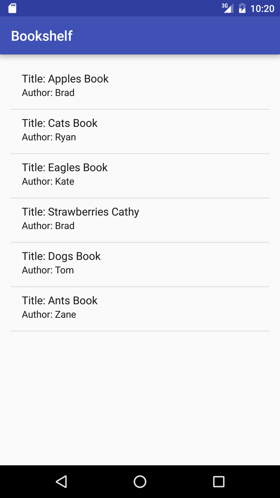
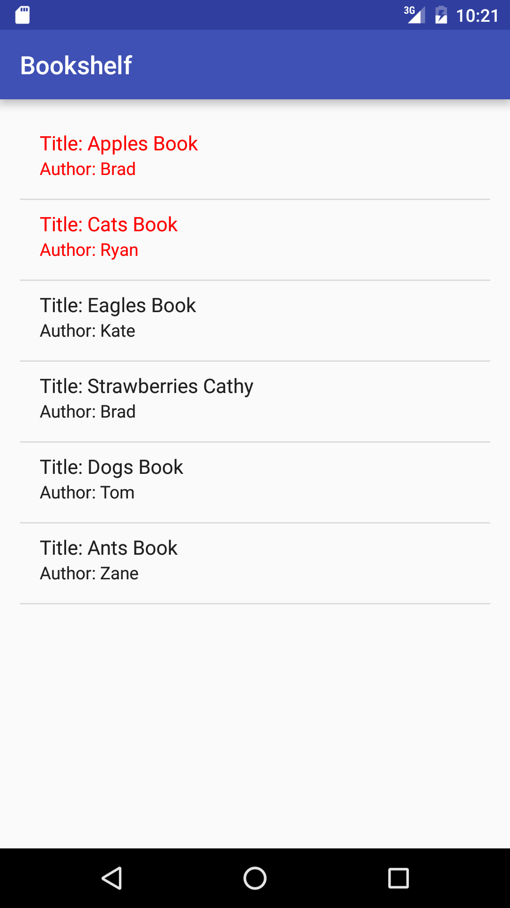

#  ListViews and ListAdapters - Bookshelf

## Introduction

> ***Note:*** _This can be a pair programming activity or done independently._

In this lab, you will be building a ListView that shows your collection of books (using Book objects). Complete all of the TODO items marked in the starter code.

The user should be able to mark a book as read when they are done. When you click on a book in the list, the text color should change to red.

**Hint:** You can use android.R.layout.simple_list_item_2 to display text.

## Exercise

#### Requirements

- Make an activity that contains a ListView which displays the book title and author
- Complete the BaseAdapter to display the book information
- Clicking a Book title changes the text to red

**Bonus:**
- Add additional book info, and use a custom layout to display it in each list item

#### Deliverable

The screenshot below shows the completed app.

  
  

## Additional Resources

- [Java Listview](http://docs.oracle.com/javase/tutorial/uiswing/components/list.html)
- [Jave ListAdapters](https://developer.android.com/reference/android/widget/ListAdapter.html)
